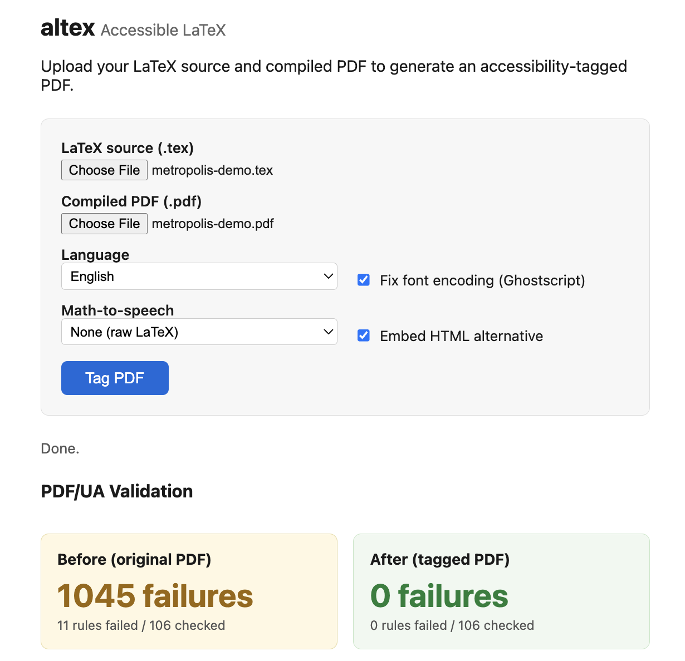

# accessible-latex

**altex** — a proof-of-concept tool that post-processes LaTeX-generated PDFs
to embed accessibility structure tags and alt-text.

Validated against [verapdf](https://verapdf.org/) (an
open-source PDF/UA validator): across 28 test documents, altex reduces
verapdf failures from **57,914 → 1,272** (97.8% reduction), with 8
documents achieving full PDF/UA-1 compliance.

## Usage

```bash
# Install everything
make setup

# Tag a PDF
python -m altex source.tex input.pdf -o output.pdf

# Start the web interface
make run
# → http://localhost:5001

# Run PDF/UA benchmarks
make benchmark

# See all available commands
make help
```

### Manual setup (without Make)

```bash
python3 -m venv .venv
source .venv/bin/activate
pip install -r requirements.txt
npm install --production    # for math-to-speech

# Tag a PDF (two inputs: LaTeX source + compiled PDF)
python -m altex source.tex input.pdf -o output.pdf

# Skip Ghostscript font encoding fix
python -m altex source.tex input.pdf --no-fix-encoding -o output.pdf

# Inspect the parsed structure (no PDF needed)
python -m altex source.tex --dump-tree
```

## What it does

1. **Parses LaTeX source** — extracts semantic structure (sections, headings,
   lists, math, code blocks, figures, links) into a document tree.
2. **Embeds PDF structure tags** — writes a PDF structure tree with proper
   hierarchy, `/ActualText` for text, `/Alt` for formulas, code, and figures.
3. **Tags content streams** — wraps each text operator (Tj/TJ) in its own
   BDC/EMC marked-content sequence with a unique MCID.  Non-text content
   (graphics, decorative rules) is marked as `/Artifact`.
4. **Links annotations** — PDF link annotations (`\href`, `\url`) are tagged
   as `/Link` structure elements with alt descriptions.
5. **Sets accessibility metadata** — document language, title, tab order,
   viewer preferences, PDF/UA-1 identification.
6. **Fixes font encoding** (default, requires Ghostscript) — normalizes font
   encodings for better character mapping.  Use `--no-fix-encoding` to skip.

## Supported LaTeX commands

| Category   | Commands                                                  |
|------------|-----------------------------------------------------------|
| Sections   | `\section`, `\subsection`, `\subsubsection`, `\paragraph` (and starred `*` variants) |
| Lists      | `\begin{itemize}`, `\begin{enumerate}`, `\begin{description}`, `\item` |
| Math       | `$...$`, `\[...\]`, `equation`, `align`, `gather` (and starred variants) |
| Code       | `verbatim`, `lstlisting`, `minted`                        |
| Figures    | `\begin{figure}`, `\includegraphics`, `\caption`          |
| Links      | `\href{url}{text}`, `\url{url}`                           |
| Includes   | `\input{}`, `\include{}`                                  |

Unknown macros are handled generically by extracting readable text from
their arguments.

## CLI options

```
python -m altex <source.tex> [<input.pdf>] [-o <output.pdf>] [options]

Options:
  --dump-tree           Print the semantic tree as JSON and exit (no PDF needed)
  --lang LANG           Document language (default: en)
  --no-fix-encoding     Skip Ghostscript font encoding fix (on by default)
  --math-speech ENGINE  Math-to-speech engine: sre, mathjax, or none (default: none)
  --embed-alt           Embed an accessible HTML alternative as a PDF attachment
```

## PDF/UA validation

altex addresses these [PDF/UA-1](https://pdfa.org/resource/iso-14289-pdfua/)
requirements (verified by [verapdf](https://verapdf.org/)):

<!-- [[TUI]] -->
```
$ verapdf -f ua1 benchmarks/homework/bu-cs237-hw.pdf
  Passed rules: 99
  Failed rules: 7
  Failed checks: 976
    [7.21.7:1] x2: The Font dictionary of all fonts shall define the map of all used
    [7.1:3] x495: Content shall be marked as Artifact or tagged as real content
    [7.1:11] x1: The logical structure of the conforming file shall be described b
    [7.1:8] x1: The Catalog dictionary of a conforming file shall contain the Met
    [6.2:1] x1: The document catalog dictionary shall include a MarkInfo dictiona
    [7.1:10] x1: The document catalog dictionary shall include a ViewerPreferences
    [7.2:34] x475: Natural language for text in page content shall be determined

$ python -m altex benchmarks/homework/bu-cs237-hw.tex benchmarks/homework/bu-cs237-hw.pdf -o tagged.pdf
Tagged PDF written to tagged.pdf

$ verapdf -f ua1 tagged.pdf
  Passed rules: 105
  Failed rules: 1
  Failed checks: 5
    [7.21.7:1] x5: The Font dictionary of all fonts shall define the map of all used
```
<!-- [[/TUI]] -->

Run `make benchmark` to validate all 17 test documents.

## Web interface

Upload `.tex` + `.pdf` in a browser, get a tagged PDF with a before/after
PDF/UA validation report.

```bash
# Local dev server
make run
# → http://localhost:5001

# Docker
make docker-run
# → http://localhost:5001
```



The web UI shows:
- **PDF/UA validation comparison** — verapdf failure count before and after,
  with specific rules fixed and any remaining issues
- **Accessibility summary** — structure element counts, alt-text coverage,
  metadata status
- **Download link** for the tagged PDF

## Kubernetes deployment

The app is fully stateless and horizontally scalable. See
[`k8s/README.md`](k8s/README.md) for full deployment instructions.

```bash
export GCP_PROJECT=my-project
export GCP_LOCATION=us-west1          # region or zone

# Use an existing cluster, or omit CLUSTER_NAME/SKIP to create one
CLUSTER_NAME=my-cluster SKIP_CLUSTER_CREATE=1 make gke-setup

# Edit k8s/overlays/gcp/managed-cert.yaml with your domain
# Edit k8s/overlays/gcp/kustomization.yaml with your project ID

make gke-deploy                       # build, push, deploy
make gke-status                       # check pods, ingress, TLS cert
make gke-teardown                     # delete all resources
```

## Project structure

```
altex/
|-- __init__.py        # Package metadata
|-- __main__.py        # python -m altex entry point
|-- cli.py             # Argument parsing and orchestration
|-- models.py          # Tag enum + DocumentNode dataclass (shared interface)
|-- latex_parser.py    # LaTeX source -> DocumentNode tree
|-- pdf_tagger.py      # Embed structure tree + MCIDs into PDF
|-- math_speech.py     # Pluggable math-to-speech (sre/mathjax/none)
|-- alt_document.py    # Generate + embed alternative HTML in PDF
`-- encoding_fixer.py  # Isolated Ghostscript wrapper (no altex imports)
web/
|-- app.py             # Flask API service (with verapdf integration)
`-- static/
    `-- index.html     # Single-file frontend (HTML/CSS/JS, no build step)
scripts/
|-- benchmark.sh       # Run PDF/UA benchmarks via verapdf
|-- benchmark_report.py # Benchmark runner + report generator
|-- update_readme.sh   # Regenerate TUI demo output in this README
|-- sre_worker.js      # Batch MathML->speech via SRE
|-- mathjax_worker.js  # Batch LaTeX->speech via mathjax-full+SRE
`-- run-local.sh       # Start dev server without Docker
benchmarks/            # .edu-sourced LaTeX test corpus (17 documents)
k8s/                   # Kubernetes deployment (see k8s/README.md)
|-- base/              # Cloud-agnostic manifests (Deployment, Service, HPA)
|-- overlays/gcp/      # GKE-specific (Ingress, ManagedCertificate)
|-- gke-setup.sh       # Create/configure GKE infrastructure
|-- gke-deploy.sh      # Build, push, deploy
`-- gke-teardown.sh    # Delete all resources
docs/
|-- tool-audit.md      # verapdf/PAVE comparison and compliance analysis
|-- design.md          # Architecture and design decisions
|-- pdf-tagging-reference.md  # PDF structure tag reference
`-- math-speech-and-alt-document.md  # Phase 4 design plan
demos/
|-- demo_compare.sh    # Before/after comparison with encoding variant
|-- demo_math_alttext.sh  # Math formula alt-text showcase
|-- demo_math_speech.sh   # Math-to-speech engine comparison
|-- demo_alt_document.sh  # Embedded alternative HTML demo
`-- demo_tag_all.sh    # Batch-tag all test documents
Makefile               # Build, run, test, benchmark commands
Dockerfile             # Single container (Flask + Ghostscript + Node)
docker-compose.yml     # Convenience wrapper
```

## Architecture

The pipeline has two stages connected by a single shared data structure
(`DocumentNode` in `models.py`):

```
LaTeX source (.tex)          Compiled PDF (.pdf)
        |                            |
        v                            |
  latex_parser.py                    |
  (pylatexenc)                       |
        |                            |
        |  DocumentNode tree         |
        v                           v
              pdf_tagger.py
              (pikepdf)
                    |
                    v
             Tagged PDF (.pdf)
```

The `encoding_fixer.py` module is fully isolated (zero altex imports) and
pre-processes the PDF through Ghostscript before tagging (on by default).

## Limitations

- Content-stream MCID linking uses fuzzy text matching between LaTeX
  source and PDF content; some elements may remain unlinked.
- Preamble macros before `\begin{document}` may produce noise nodes
  (mitigated by empty-heading pruning).
- Custom class/package commands are handled generically, not semantically.
- Font encoding fix depends on Ghostscript being installed.
- Remaining verapdf failures (1,272 across 28 docs) are all §7.21.7:1
  (font ToUnicode) — a font-level issue in math/symbol fonts that only
  `--fix-encoding` or re-compilation with modern LaTeX engines can address.

## Dependencies

- [pikepdf](https://pikepdf.readthedocs.io/) — PDF structure manipulation
- [pylatexenc](https://pylatexenc.readthedocs.io/) — LaTeX parsing
- [Flask](https://flask.palletsprojects.com/) — web service (optional)
- [Ghostscript](https://www.ghostscript.com/) — font encoding fix (recommended)
- [verapdf](https://verapdf.org/) — PDF/UA validation (optional, used in web UI and benchmarks)
